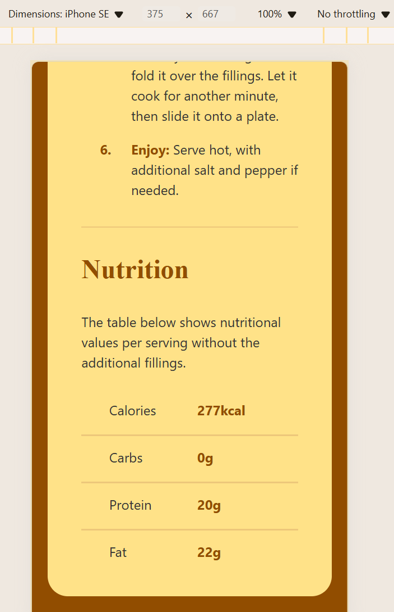

# Frontend Mentor - Recipe page solution

This is a solution to the [Recipe page challenge on Frontend Mentor](https://www.frontendmentor.io/challenges/recipe-page-KiTsR8QQKm). 
I created a recipe page for an omelette (hopefully, it's delicious) as part of a task from Frontend Mentor. I used my own approach to design while following the main requirements of the challenge.

## Table of contents

- [Overview](#overview)
  - [Screenshot](#screenshot)
  - [Links](#links)
- [My process](#my-process)
  - [Built with](#built-with)
  - [What I learned](#what-i-learned)
  - [Continued development](#continued-development)
- [Author](#author)


## Overview

### Screenshot




### Links
- Live Site URL: [My live page](https://grimm-n.github.io/receipt-page/)

## My process

### Built with
- Semantic HTML5 markup
- CSS custom properties
- Flexbox
- CSS Grid

### What I learned

I finally used <table> elements in my design!

```html
<section class="nutrition"> <!-- section nutrition opened -->
      <h2 class="section__title">Nutrition</h2>
      <p class="section__text">The table below shows nutritional values per serving without the additional fillings.</p>
      <table> <!-- table for list (columns) -->
        <tbody class="nutrition__table">
          <tr class="nutrition__item">
            <th>Calories</th> 
            <td>277kcal</td>
          </tr>
          <tr class="nutrition__item">
            <th>Carbs</th> 
            <td>0g</td>
          </tr>
          <tr class="nutrition__item">
            <th>Protein</th> 
            <td>20g</td>
          </tr>
          <tr class="nutrition__item">
            <th>Fat</th> 
            <td>22g</td>
          </tr>
       </tbody>
     </table>  <!-- table closed -->
    </section> <!-- section nutrition closed -->
```

### Continued development

In future projects, I want to continue improving my skills with CSS Grid and Flexbox to create more complex and responsive layouts. Additionally, I plan to learn more about JavaScript to add interactive elements to my web pages. I also want to refine my use of CSS animations to make user interfaces more engaging.

Also, I want to focus on optimizing my projects for mobile devices. Currently, I believe this is one of the most important components of modern web development. My goal is to ensure that my websites are fully responsive and provide a seamless user experience across all screen sizes.


## Author
- Frontend Mentor - [@Grimm-N](https://www.frontendmentor.io/profile/Grimm-N)
- Twitter - [@Grimm__N](https://x.com/Grimm__N)
